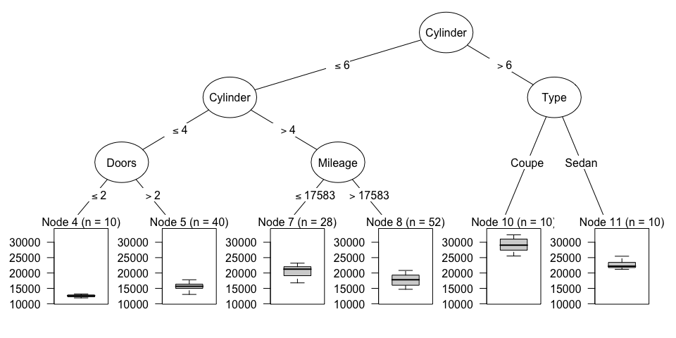
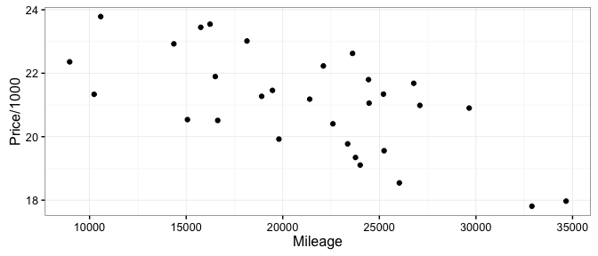
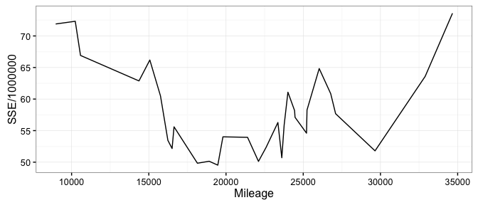
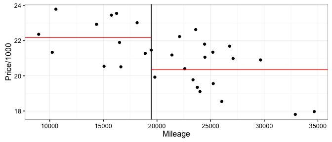

# Regression Tree Models Tutorial
Lauren Savage  
May 10, 2016  

Classification models predict categorical responses (e.g. success/failure), whereas regression models predict continuous responses.

We'll be using an example dataset from Kelly Blue Book 2005 to predict the prices of used cars (a continuous response).


```r
cars.df <- read.csv("kelly_blue_book_2005.csv",
                    header = TRUE, stringsAsFactors = TRUE)
head(cars.df)
```

```
##      Price Mileage  Make   Model     Trim  Type Cylinder Liter Doors
## 1 17314.10    8221 Buick Century Sedan 4D Sedan        6   3.1     4
## 2 17542.04    9135 Buick Century Sedan 4D Sedan        6   3.1     4
## 3 16218.85   13196 Buick Century Sedan 4D Sedan        6   3.1     4
## 4 16336.91   16342 Buick Century Sedan 4D Sedan        6   3.1     4
## 5 16339.17   19832 Buick Century Sedan 4D Sedan        6   3.1     4
## 6 15709.05   22236 Buick Century Sedan 4D Sedan        6   3.1     4
##   Cruise Sound Leather
## 1      1     1       1
## 2      1     1       0
## 3      1     1       0
## 4      1     0       0
## 5      1     0       1
## 6      1     1       0
```

The goal of a tree is to split the data into groups that are similar with respect to the response.  This is done by creating binary splits one variable at a time.

### Example Regression Tree

The regression tree below was grown using Pontiacs from our used car dataset.


```r
pontiac.df <- subset(cars.df, Make=="Pontiac")
one_tree <- ctree(Price ~ Mileage + Type + Cylinder + Doors + Cruise + Sound + Leather, 
                  data = pontiac.df, 
                  controls = ctree_control(maxdepth=3))
plot(one_tree, 
     inner_panel=node_inner(one_tree, pval = FALSE, id = FALSE))
```

<!-- -->

We can see that the regression tree has successfully split Pontiacs into groups with different prices.  For example, Pontiacs with > 6 cylinders and of type coupe (in Node 10) had prices around $30,000, but Pontiacs with <= 6 cylinders, <= 4 cylinders, and <= 2 doors (in Node 4) had prices around $12,500.  Notice that the tree split twice on the same variable, cylinder, which is okay.

This tree can be used to predict the prices of new records by following the splits to the corresponding terminal nodes.  The prediction is the average price of cars in the terminal node.  For example, this tree will predict that any sedans with > 6 cylinders have a price of $22,578.

### Choosing Splits

At each node, the tree-building algorithm searches through each variable for the "best" split and then chooses the "best" variable to split on, where the definition of "best" depends on the methodology.

* **CART**, implemented in the rpart package

The best split minimizes the sum of squares error.  This is a way of quanitifying how far the true responses are from the predicted response, the average at each node. The formula for sum of squares error is:

$$ SSE = \sum\nolimits_{i \in S_1} (y_i - \bar{y}_1)^2 + \sum\nolimits_{i \in S_2} (y_i - \bar{y}_2)^2$$

Let's look at how CART would choose the best split for mileage on a group of Buick Lacrosses.


```r
lacrosse.df <- subset(cars.df, Model=="Lacrosse")
ggplot(lacrosse.df, aes(y = Price/1000, x = Mileage)) + 
        geom_point() + theme_bw()
```

<!-- -->

We can see that there's some relationship between mileage and price, where lower mileage cars tend to be more expensive.

Let's calculate the sum of squares error for each potential split on mileage.


```r
n_cars <- nrow(lacrosse.df)
SSE.df <- data.frame(Mileage = sort(lacrosse.df$Mileage), 
                     SSE = numeric(n_cars), 
                     group1_mean = numeric(n_cars), 
                     group2_mean = numeric(n_cars))
for(i in 1:n_cars){
    mileage <- SSE.df$Mileage[i]
    group1.df <- lacrosse.df[lacrosse.df$Mileage <= mileage,]
    group2.df <- lacrosse.df[lacrosse.df$Mileage > mileage,]
    SSE.df$group1_mean[i] <- mean(group1.df$Price)
    SSE.df$group2_mean[i] <- mean(group2.df$Price)
    SSE.df$SSE[i] <- sum((group1.df$Price - SSE.df$group1_mean[i])^2) + 
        sum((group2.df$Price - SSE.df$group2_mean[i])^2)
}
ggplot(SSE.df, aes(x=Mileage, y=SSE/1000000)) + geom_line() + theme_bw()
```

<!-- -->

We obtain the minimum sum of squares error when we split on mileage <= 19,467.

Let's see what this split looks like. The predictions for the two groups are in red.


```r
best_split.df <- SSE.df[which.min(SSE.df$SSE),]
average1.df <- data.frame(x=c(-Inf, best_split.df$Mileage), 
                          y=rep(best_split.df$group1_mean, 2))
average2.df <- data.frame(x=c(best_split.df$Mileage, Inf), 
                          y=rep(best_split.df$group2_mean, 2))
ggplot(lacrosse.df, aes(y=Price/1000, x=Mileage)) + 
        geom_point() + theme_bw() + 
        geom_vline(xintercept=best_split.df$Mileage) +
        geom_line(data=average1.df, aes(x=x, y=y/1000), color="red") +
        geom_line(data=average2.df, aes(x=x, y=y/1000), color="red")
```

<!-- -->

There's a second commonly used method for choosing the best split.

* **Conditional Inference**, implemented in the party package

This algorithm conducts statistical tests for each possible split and chooses the best split as the one with the smallest p-value.

### Regression Trees vs Linear Regression

Let's take a moment to consider the advantages and disadvantages of single regression trees compared to another popular approach, linear regression.

* Trees can model complicated interactions while linear regression mostly models main effects (unless interaction terms are added)
* Linear regression requires strict assumptions of linearity, additivity, and normality while trees require no such assumptions
* A single tree is unstable - removing just one record can change the entire structure
* A single tree can only predict a few values (for example, the first tree we grew only had 6 terminal nodes, so it could only make 6 different predictions)

The solution to several of the problems with single trees is an ensemble model, such as...

### Random Forest

