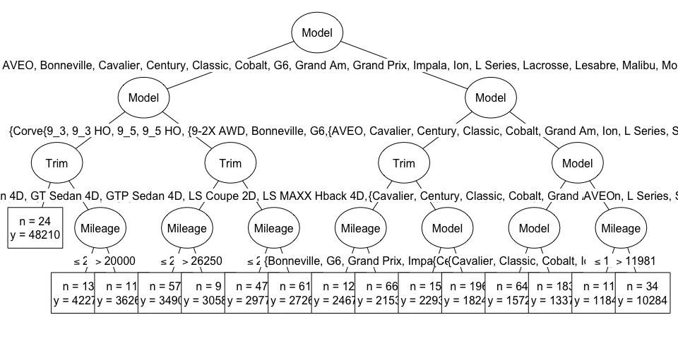
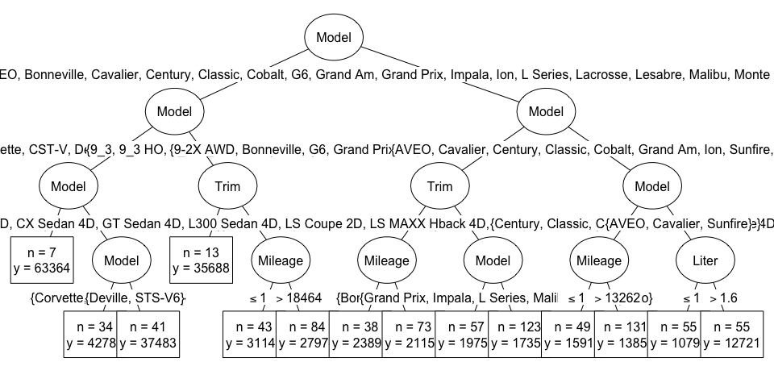
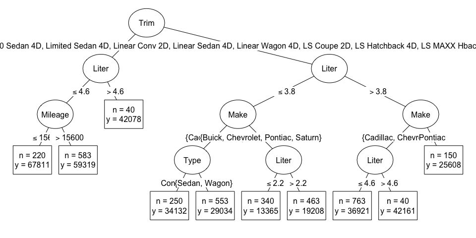

# Regression Tree Models Tutorial
Lauren Savage  

# Regression Trees

Classification models predict categorical responses (e.g. success/failure), whereas regression models predict continuous responses.

We'll be using an example dataset from Kelly Blue Book 2005 to predict the prices of used cars (a continuous response).


```r
cars.df <- read.csv("kelly_blue_book_2005.csv", header = TRUE, stringsAsFactors = TRUE)
head(cars.df)
```

```
##      Price Mileage  Make   Model     Trim  Type Cylinder Liter Doors
## 1 17314.10    8221 Buick Century Sedan 4D Sedan        6   3.1     4
## 2 17542.04    9135 Buick Century Sedan 4D Sedan        6   3.1     4
## 3 16218.85   13196 Buick Century Sedan 4D Sedan        6   3.1     4
## 4 16336.91   16342 Buick Century Sedan 4D Sedan        6   3.1     4
## 5 16339.17   19832 Buick Century Sedan 4D Sedan        6   3.1     4
## 6 15709.05   22236 Buick Century Sedan 4D Sedan        6   3.1     4
##   Cruise Sound Leather
## 1      1     1       1
## 2      1     1       0
## 3      1     1       0
## 4      1     0       0
## 5      1     0       1
## 6      1     1       0
```

The goal of a tree is to split the data into groups that are similar with respect to the response.  This is done by creating binary splits one variable at a time.

## Example Regression Tree

The regression tree below was grown using Pontiacs from our used car dataset.


```r
pontiac.df <- subset(cars.df, Make == "Pontiac")
one_tree <- ctree(Price ~ Mileage + Type + Cylinder + Doors + Cruise + Sound + Leather, 
                  data = pontiac.df, 
                  controls = ctree_control(maxdepth = 3))
plot(one_tree, inner_panel = node_inner(one_tree, pval = FALSE, id = FALSE))
```

<!-- -->

We can see that the regression tree has successfully split Pontiacs into groups with different prices.  For example, Pontiacs with > 6 cylinders and of type coupe (in Node 10) had prices around $30,000, but Pontiacs with <= 6 cylinders, <= 4 cylinders, and <= 2 doors (in Node 4) had prices around $12,500.  Notice that the tree split twice on the same variable, cylinder, which is okay.

This tree can be used to predict the prices of new records by following the splits to the corresponding terminal nodes.  The prediction is the average price of cars in the terminal node.  For example, this tree will predict that any sedans with > 6 cylinders have a price of $22,578.

## Choosing Splits

At each node, the tree-building algorithm searches through each variable for the "best" split and then chooses the "best" variable to split on, where the definition of "best" depends on the methodology.

### CART

(Implemented in the rpart package.)

The best split minimizes the sum of squares error.  This is a way of quanitifying how far the true responses are from the predicted response, the average at each node. The formula for sum of squares error is:

$$ SSE = \sum\nolimits_{i \in S_1} (y_i - \bar{y}_1)^2 + \sum\nolimits_{i \in S_2} (y_i - \bar{y}_2)^2$$

Let's look at how CART would choose the best split for mileage on a group of Buick Lacrosses.


```r
lacrosse.df <- subset(cars.df, Model == "Lacrosse")
ggplot(lacrosse.df, aes(y = Price/1000, x = Mileage)) + 
        geom_point() + theme_bw()
```

<!-- -->

We can see that there's some relationship between mileage and price, where lower mileage cars tend to be more expensive.

Let's calculate the sum of squares error for each potential split on mileage.


```r
n_cars <- nrow(lacrosse.df)
SSE.df <- data.frame(Mileage = sort(lacrosse.df$Mileage), 
                     SSE = numeric(n_cars), 
                     group1_mean = numeric(n_cars), 
                     group2_mean = numeric(n_cars))
for(i in 1:n_cars){
    mileage <- SSE.df$Mileage[i]
    group1.df <- lacrosse.df[lacrosse.df$Mileage <= mileage,]
    group2.df <- lacrosse.df[lacrosse.df$Mileage > mileage,]
    SSE.df$group1_mean[i] <- mean(group1.df$Price)
    SSE.df$group2_mean[i] <- mean(group2.df$Price)
    SSE.df$SSE[i] <- sum((group1.df$Price - SSE.df$group1_mean[i])^2) + 
        sum((group2.df$Price - SSE.df$group2_mean[i])^2)
}
ggplot(SSE.df, aes(x = Mileage, y = SSE/1000000)) + geom_line() + theme_bw()
```

<!-- -->

We obtain the minimum sum of squares error when we split on mileage <= 19,467.

Let's see what this split looks like. The predictions for the two groups are in red.


```r
best_split.df <- SSE.df[which.min(SSE.df$SSE),]
average1.df <- data.frame(x = c(-Inf, best_split.df$Mileage), 
                          y = rep(best_split.df$group1_mean, 2))
average2.df <- data.frame(x = c(best_split.df$Mileage, Inf), 
                          y = rep(best_split.df$group2_mean, 2))
ggplot(lacrosse.df, aes(y = Price/1000, x = Mileage)) + 
        geom_point() + theme_bw() + 
        geom_vline(xintercept = best_split.df$Mileage) +
        geom_line(data = average1.df, aes(x = x, y = y/1000), color = "red") +
        geom_line(data = average2.df, aes(x = x, y = y/1000), color = "red")
```

<!-- -->

There's a second commonly used method for choosing the best split...

### Conditional Inference

(Implemented in the party package.)

This algorithm conducts statistical tests for each possible split and chooses the best split as the one with the smallest p-value.

## Regression Trees vs Linear Regression

Let's take a moment to consider the advantages and disadvantages of single regression trees compared to another popular approach, linear regression.

* Trees can model complicated interactions while linear regression mostly models main effects (unless interaction terms are added)
* Linear regression requires strict assumptions of linearity, additivity, and normality while trees require no such assumptions
* A single tree is unstable - removing just one record can change the entire structure
* A single tree can only predict a few values (for example, the first tree we grew only had 6 terminal nodes, so it could only make 6 different predictions)

The solution to several of the problems with single trees is an ensemble model, such as...

# Random Forest

What if we could average together many different regression trees to get a more stable, nuanced model?

## Bagged Regression Trees

Bagging is short for **b**ootstrap **agg**regation.  This is an ensemble method wherein many different trees are grown using bootstrap samples of the original dataset.  (Bootstrap sampling is just random sampling *with* replacement.)  Predictions of each tree are averaged to create aggregate predictions.  Averaging together creates predictions with lower variance than predictions from a single tree.

Let's create our own bagged model with 4 trees (typically you would grow many more trees).  We'll set aside the first row of our dataset to make predictions on.


```r
(cars_first.df <- cars.df[1,])
```

```
##     Price Mileage  Make   Model     Trim  Type Cylinder Liter Doors Cruise
## 1 17314.1    8221 Buick Century Sedan 4D Sedan        6   3.1     4      1
##   Sound Leather
## 1     1       1
```

```r
cars_minus_first.df <- cars.df[-1,]
n_samples <- nrow(cars_minus_first.df)
n_trees <- 4
predictions <- numeric(n_trees)
set.seed(235)
for(i in 1:n_trees){
    cars_bootstrap.df <- cars_minus_first.df[sample(1:n_samples, n_samples, replace = TRUE),]
    one_tree <- ctree(Price ~ Mileage + Make + Model + Trim + Type + Cylinder + 
                          Liter + Doors + Cruise + Sound + Leather, 
                  data = cars_bootstrap.df, 
                  controls = ctree_control(maxdepth = 4))
    plot(one_tree, type="simple", 
         inner_panel=node_inner(one_tree, pval = FALSE, id = FALSE), 
         terminal_panel=node_terminal(one_tree, digits = 0, fill = c("white"), id = FALSE))
    predictions[i] <- predict(one_tree, cars_first.df)
    print(paste("Prediction of single tree for the held out record:", format(predictions[i], digits=0)))
}
```

<!-- -->

```
## [1] "Prediction of single tree for the held out record: 15117"
```

<!-- -->

```
## [1] "Prediction of single tree for the held out record: 15729"
```

<!-- -->

```
## [1] "Prediction of single tree for the held out record: 15918"
```

<!-- -->

```
## [1] "Prediction of single tree for the held out record: 13287"
```

You can follow each tree to see why it's making the prediction it is.  To get the aggregate prediction, we average together all 4 values:


```r
mean(predictions)
```

```
## [1] 15012.78
```

The real price was $17,314, but our prediction was $15,012.  Maybe we can still improve the bagged model...

## Random Forest

Notice that the structure of the above trees is the same.  Each tree splits on Model first because it's the most important variable.  Because Model dominates, it's hard for our trees to learn from any other variables.  These trees are highly correlated, so we haven't taken full advantage of aggregation to make a more stable model.

Random forest introduces another element of randomness.  At each split, only some variables are considered for splitting. In our example, this means Model won't always be the first split.


```r
set.seed(903)
cars.rf <- cforest(Price ~ Mileage + Make + Model + Trim + Type + Cylinder + 
                          Liter + Doors + Cruise + Sound + Leather, 
                  data = cars_minus_first.df, 
                  controls = cforest_control(ntree = n_trees, maxdepth = 4))
for(i in 1:n_trees){
    one_tree <- get_cTree(cars.rf, i) #see Acknowledgements section
    plot(one_tree, type="simple", 
         inner_panel=node_inner(one_tree, pval = FALSE, id = FALSE), 
         terminal_panel=node_terminal(one_tree, digits = 0, fill = c("white"), id = FALSE))    
}
```

<!-- --><!-- --><!-- --><!-- -->

Notice how different each of these trees are! 


```r
predict(cars.rf, cars_first.df, OOB=TRUE)
```

```
##         Price
## [1,] 16668.64
```

Our random forest predicts that the price of the first record will be $16,668.

## Out-of-bag (OOB) Samples

One advantage of bagged trees and random forest is that each tree is grown using only a subset of the original dataset.  On average, about 63% of records in the original dataset end up in a bootstrap sample.  Because the other 37% (the out-of-bag samples) aren't seen by the tree at all, they can be used to produce performance metric for that tree.

Let's see how this works with a single bagged tree. 


```r
# create bootstrap sample and out-of-bag sample
n_samples <- nrow(cars.df)
set.seed(348)
bootstrap_index <- sample(1:n_samples, n_samples, replace = TRUE)
cars_bootstrap.df <- cars.df[bootstrap_index,]
cars_oob.df <- cars.df[-bootstrap_index,]
# grow tree
one_tree <- ctree(Price ~ Mileage + Make + Model + Trim + Type + Cylinder + 
                      Liter + Doors + Cruise + Sound + Leather, 
                  data = cars_bootstrap.df, 
                  controls = ctree_control(maxdepth = 4))
# find percent oob sample
nrow(cars_oob.df)/n_samples
```

```
## [1] 0.3731343
```

The OOB sample is 37% of the original dataset, as we expected.

Now we can predict the price of each OOB sample and calculate a performance metric for that tree.  We'll use root mean square error.


```r
sqrt(sum((predict(one_tree, cars_oob.df) - cars_oob.df$Price)^2)/nrow(cars_oob.df))
```

```
## [1] 2363.479
```

This is the root mean square error for a single tree.  If we had an entire bagged tree model or random forest, we could aggregate the performance metrics of the individual trees to get an estimate of the performance of the forest.  

This estimate would be useful if we wanted to compare different models...

## Tuning Parameters


# Acknowledgements

* Data is from Kelly Blue Book and can be found here: http://www.amstat.org/publications/jse/v16n3/datasets.kuiper.html

* Many concepts in this tutorial come from Applied Predictive Modeling by Kjell Johnson and Max Kuhn, which I highly recommend for more in-depth understanding of regression tree models 

* Code for grabbing individual trees from cforest() was taken from Marco Sandri: http://stackoverflow.com/questions/19924402/cforest-prints-empty-tree
